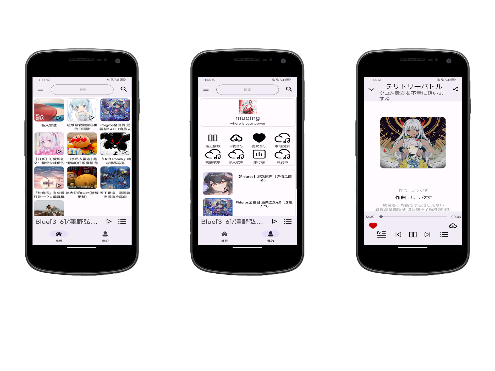

云音乐是什么?
一个对接网易云的音乐播放器  
  * 内置集成作者自己写的歌词Lrc组件支持单行歌词和多行歌词支持悬浮窗歌词。  
  * 内置适配Android13的通知栏 （不完善请大佬请教）    
  * 对接了网易云的歌单，歌曲，搜索，二维码登录等其余功能。  
  * main.java-内api变量是网易云SDK后台服务器地址（可变更）  
  * http 是我服务器php接口的地址用于软件更新用或者其他功能（个根据需要做出必须的更改或者删除）  

进度：
* UI
  * 歌单
  * 音乐播放选择列表
  * 音乐播放器控制界面
  * 登陆
  * 设置
  * 侧滑栏内小功能
* 代码
  * 适配主题和UI美化
  * 维护接口（不完善）
  * 蓝牙功能
  * 通知栏控制
  * 悬浮歌词功能
  * 基本播放器功能（控制暂停 上下曲 播放歌单操作）
    


有问题反馈
在使用中有任何问题，欢迎反馈给我，可以用以下联系方式跟我交流

* [邮件](<a target="_blank" href="http://mail.qq.com/cgi-bin/qm_share?t=qm_mailme&email=MAEJBgYJBAQDAABwQUEeU19d" style="text-decoration:none;"></a>)
* QQ:1966944300
* 后台源码-Github: [网易云音乐 API](https://github.com/Binaryify/NeteaseCloudMusicApi)

##捐助开发者
在兴趣的驱动下,写一个`免费`的东西，有欣喜，也还有汗水，希望你喜欢我的作品，同时也能支持一下。
##关于作者

```javascript
var jieshao = {
  name  "云音乐"
  versionCode 1
  versionName "1.8.0"
}
```